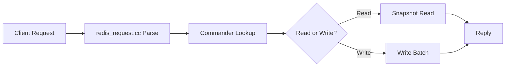

# Code Navigator

## Core Rule: Every Code Reference Must Be Clickable

**NEVER** mention a class, function, variable, or file without a clickable link.

### Link Format

| Scenario | Format | Example |
|----------|--------|---------|
| Symbol with known lines | `[symbol](file:///abs/path#L10-L25)` | `[Server::Start()](file:///root/kvrocks/src/server/server.cc#L142-L158)` |
| Symbol at single line | `[symbol](file:///abs/path#L42)` | `[kCmdWrite](file:///root/kvrocks/src/commands/commander.h#L35)` |
| Whole file | `[filename](file:///abs/path)` | `[server.cc](file:///root/kvrocks/src/server/server.cc)` |
| Unknown exact lines | `[symbol](file:///abs/path)` | Never guess line numbers |

**Rules**:
- Always use **absolute paths** (e.g., `file:///root/kvrocks/src/...`)
- Use `#L{start}-L{end}` for ranges, `#L{line}` for single lines
- **Never guess line numbers** — use LSP `goToDefinition` or `Read` tool to get exact lines
- Include `()` for functions/methods: `Foo::Bar()`, not `Foo::Bar`
- Include `::` scope for class members: `Server::Start()`

## Presenting Code Paths

When explaining how code works, use this structure:

### Call Chain Format

```markdown
## Call Chain: [brief description]

1. **Entry**: [Commander::Execute()](file:///path#L10) — command dispatch entry point
2. **Route**: [StringCommander::Execute()](file:///path#L45-L52) — routes to specific command
3. **Impl**: [CommandGet::Execute()](file:///path#L80-L95) — actual GET implementation
4. **Storage**: [Database::Get()](file:///path#L200-L215) — RocksDB read operation

```

Each step: **numbered** + **bold label** + **clickable link** + **brief explanation**

### Decision/Branch Points

When code branches, show both paths:

```markdown
At [Server::OnCommand()](file:///path#L100-L105), flow splits:

- **Read command** → [Worker::HandleRead()](file:///path#L120) → snapshot read path
- **Write command** → [Worker::HandleWrite()](file:///path#L135) → write batch path
```

### Class Hierarchy

```markdown
Inheritance chain:
`[Commander](file:///path#L20)` (base)
  → `[BlockingCommander](file:///path#L80)` (blocking ops)
    → `[CommandBLPop](file:///path#L150)` (BLPOP impl)
```

## Code Snippets

Always prefix code snippets with a clickable file link header:

```markdown
[server.cc#L142-L158](file:///root/kvrocks/src/server/server.cc#L142-L158):
```cpp
Status Server::Start() {
  // ... implementation
}
```
```

For multi-file comparisons, show each with its own header:

```markdown
**Declaration** — [server.h#L85](file:///root/kvrocks/src/server/server.h#L85):
```cpp
Status Start();
```

**Implementation** — [server.cc#L142](file:///root/kvrocks/src/server/server.cc#L142):
```cpp
Status Server::Start() { ... }
```
```

## Navigation Workflow

When the user asks "how does X work" or reads code:

1. **Find entry point** — use LSP `goToDefinition` or `SearchCodebase` to locate the starting symbol
2. **Get exact lines** — use `Read` tool or LSP to get precise line numbers
3. **Trace the chain** — follow call hierarchy using `outgoingCalls` / `incomingCalls`
4. **Present with links** — output numbered steps, every step has a clickable link
5. **Summarize the path** — end with a one-line summary listing key files involved

### Example Output

> **How does the GET command work?**
>
> 1. Client sends `GET key` → [redis_request.cc](file:///root/kvrocks/src/server/redis_request.cc) parses the protocol
> 2. Dispatch via [CommandTable::Get()](file:///root/kvrocks/src/commands/commander.cc#L50)
> 3. [CommandGet::Parse()](file:///root/kvrocks/src/commands/cmd_string.cc#L30-L35) validates arguments
> 4. [CommandGet::Execute()](file:///root/kvrocks/src/commands/cmd_string.cc#L36-L50) calls storage layer
> 5. [Database::Get()](file:///root/kvrocks/src/types/string.cc#L80-L100) reads from RocksDB
>
> **Key files**: [cmd_string.cc](file:///root/kvrocks/src/commands/cmd_string.cc), [string.cc](file:///root/kvrocks/src/types/string.cc)

## Diagrams for Complex Flows

For flows with >5 steps or branching, add a mermaid diagram:



Only include file links in node labels when the diagram stays readable.

## Anti-Patterns

- **BAD**: "The Server class handles this" (no link)
- **GOOD**: "[Server](file:///root/kvrocks/src/server/server.h#L45) handles this"
- **BAD**: "in server.cc around line 100" (no link, imprecise)
- **GOOD**: "[Server::Start()](file:///root/kvrocks/src/server/server.cc#L100-L115)"
- **BAD**: Guessing line numbers from memory
- **GOOD**: Using LSP/Read to verify exact lines before generating links
